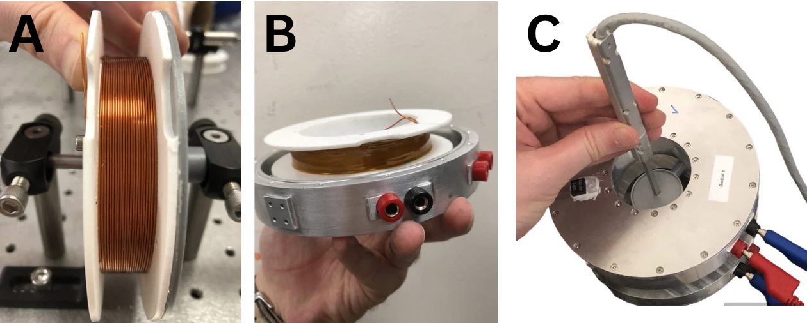

# BioCoil

# README: Coil Assembly Instructions

## Overview

Welcome to the assembly instructions for constructing the copper coils used in our project. These coils are an essential component for generating magnetic fields in a controlled manner. The assembly process involves the use of a 3D-printed holder, copper wires, thermally conductive glue, epoxy, and silicone sealant. Follow the step-by-step guide below to prepare the coils successfully.

## Materials Required

1. 3D-printed coil holder (thermoplastic material)
2. 96 copper wires (0.71 mm diameter)
3. Thermally conductive glue (10 gr of GENNEL G109)
4. Two-part epoxy (J-B Weld 8276)
5. Silicone sealant (Aqueon) 
6. Coil enclosure
7. Multi-axes magnetometer (F71 Multi-axis sensor)

## Assembly Instructions

1. **3D-Printed Holder**: The copper coils are wound around a 3D-printed holder made from thermoplastic material. Ensure that the holder is sturdy, lightweight, and corrosion-free.

2. **Copper Wires**: Wind 96 copper wires with a diameter of 0.71 mm around the 3D-printed holder. Secure the coils' surfaces using thermally conductive glue (GENNEL G109). 

3. **Electrical Connections**: Place the wound coils inside the coil enclosure and establish the necessary electrical connections.

4. **Sealing Electrical Connections**: To seal the electrical connections, apply a two-part epoxy (J-B Weld 8276).

5. **Waterproofing**: Prevent water leakage by applying silicone sealant (Aqueon). Firmly fix the caps to the coil enclosure to ensure a watertight seal.

6. **Quality Check**: After assembly, confirm the absence of leaks. 

7. **Magnetic Field Measurement**: Use a multi-axes magnetometer (F71 Multi-axis sensor) to measure the produced magnetic fields when different currents are applied.

   
